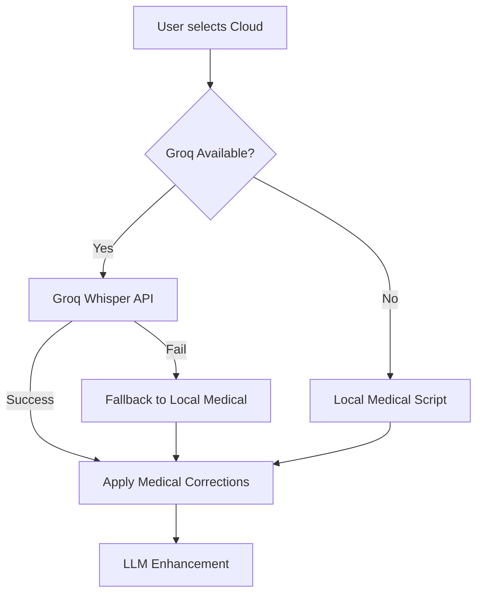

# 🚀 Groq Whisper Integration Guide

## Overview

Your Lexxi Medical app now supports **ultra-fast cloud transcription** using Groq's Whisper API alongside your existing local Whisper scripts.

## 🌟 What's New

### Cloud Transcription Option

- **☁️ Cloud Mode**: Uses Groq's Whisper API (5-15 seconds)
- **Automatic Fallback**: Falls back to local transcription if Groq fails
- **Medical Corrections**: Same medical terminology corrections applied
- **Smart Selection**: UI automatically hides cloud option if API not available

## ⚡ Speed Comparison

| Mode        | Model                 | Time          | Best For                     |
| ----------- | --------------------- | ------------- | ---------------------------- |
| ☁️ Cloud    | Groq Whisper Large v3 | 5-15 seconds  | **Fastest** - Any size audio |
| ⚡ Fast     | Local Tiny            | 7-15 seconds  | Small files                  |
| 🎯 Accurate | Local Base            | 30-60 seconds | Better accuracy              |
| 🏥 Medical  | Local Small           | 1-3 minutes   | **Best medical terms**       |

## 🔧 Setup

### 1. Get Groq API Key

1. Visit [https://console.groq.com/](https://console.groq.com/)
2. Create account and get your API key
3. Add to your `.env.local`:

```bash
GROQ_API_KEY=your_actual_groq_api_key_here
```

### 2. Usage

- The cloud option appears automatically when API key is configured
- Select "☁️ سحابي" (Cloud) for fastest transcription
- Includes same medical terminology corrections as local scripts

## 🏥 Medical Features

### Arabic Medical Corrections

Both cloud and local transcription include comprehensive Arabic medical term corrections:

```typescript
// Example corrections applied
'مريد' → 'المريض'           // Patient
'يعان من' → 'يعاني من'      // Suffers from
'صق' → 'الساق'             // Leg
'درجات الحرار' → 'درجات الحرارة'  // Temperature
'كسر في صق' → 'كسر في الساق'    // Leg fracture
```

### Medical Context Prompt

Cloud transcription uses medical context prompt:

```arabic
المريض يعاني من ألم في الصدر والرأس. الطبيب يفحص المريض ويكتب التشخيص والعلاج.
```

## 🔄 Automatic Fallback System



## 💡 Benefits

### Speed

- **10x faster** than local transcription for large files
- No model loading time (instant start)
- Parallel processing on Groq's infrastructure

### Reliability

- Automatic fallback to local if cloud fails
- No dependency on local Python/Whisper setup for cloud mode
- Same medical corrections regardless of source

### User Experience

- Transparent selection - users choose by speed preference
- Visual indicators show transcription source
- Consistent results across all modes

## 📊 Technical Details

### Groq Whisper Implementation

```typescript
// Uses Groq's Whisper Large v3 Turbo model
const result = await groqTranscriber.transcribe(audioFile, {
  language: "ar",
  model: "whisper-large-v3-turbo", // Fastest Groq model
  temperature: 0.0, // Deterministic for medical accuracy
});
```

### Error Handling

- Graceful fallback to local transcription
- User-friendly error messages
- Automatic retry mechanisms

## 🎯 When to Use Each Mode

| Scenario               | Recommended Mode       | Why                      |
| ---------------------- | ---------------------- | ------------------------ |
| Quick patient notes    | ☁️ Cloud               | Speed + accuracy         |
| Detailed consultations | 🏥 Medical             | Best medical terminology |
| No internet connection | 🎯 Accurate/🏥 Medical | Local processing         |
| Very long recordings   | ☁️ Cloud               | No timeout issues        |
| Privacy-sensitive      | 🏥 Medical             | Local processing         |

## 🔐 Security & Privacy

- **Cloud**: Audio sent to Groq (US-based, secure)
- **Local**: Audio never leaves your machine
- **All modes**: Temporary files deleted after processing
- **Choice**: Users can select based on privacy needs

---

**Next Steps**: Test the cloud transcription with your Groq API key and compare speed differences! 🚀
